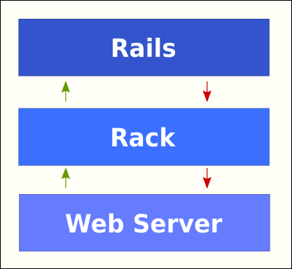

# Sinatra Forms and REST

## Goals

- [ ] Review: Rake, Rack, Shotgun, Sinatra, Corneal, CRUD, REST
- [ ] Implementation of RESTful Routing & HTML forms
- [ ] Render vs. Redirect

## Review

### Rake

- Task runner
- We can create our own tasks or use tasks that other frameworks provide to us e.g. `sinatra/activerecord/rake`

### Rack

- Interface between the web server and the web framework (it allows those two to communicate)
  

- Benefits

  - Rack allows us to use different frameworks (Sinatra, Rails) & servers (Puma, Thin) interchangeably
  - The web server doesn't need to know about the framework and vice versa
  - Rack sits in the middle of every web request & response, which means it can denying access to unwanted requests, keep track of slow responses etc.

### Shotgun

- Automatic reloading of server for Rack based applications
- It starts one of Rack's supported servers (e.g., puma, thin) and listens for requests and changes

### Sinatra

- A DSL (Domain Specific Language) for quickly creating web applications in Ruby
- Lightweight version of Rails

### Corneal

- A Ruby gem that is a Sinatra app generator with Rails-like simplicity (to implement basic directory structure of MVC App in Sinatra)

### CRUD (Create, Read, Update, Delete)

### REST (Representational State Transfer)

- RESTful routes provide a design pattern that allows for easy data manipulation (It’s nicer for users and nicer for developers to have everything consistent)
- Many of the CRUD actions are different actions that occur on the same resource
  
  

## Implementation of RESTful Routing

- `Index`
- `Show`
- `New`
- `Edit`
- `Delete`

## Render vs. Redirect

### Render (`erb`)

- The `erb` syntax allows you to render partials, it knows to look in our views folder to render a certain view
- You can pass information via `instance variables` to your views from the controller
- `erb` does NOT create a new `get` request instead it's a reference to a file that will load in the browser

### Redirect (`redirect`)

- A redirect will make a separate http request to the server
- Does not allow for `instance variables` to be passed along

### When to use each one

General rule of thumb: If it’s a _successful_ `post`, `patch`, `delete`, or an _unsuccessful_ `get` do a redirect (otherwise render)

Things to keep in mind:

1. Don’t make a new HTTP request when not necessary
2. Remember that a “render” doesn't change the url of the page, make sure the urls make sense to the user when you use render.
3. When we submit a form successfully we want to redirect to prevent resubmission of that form
